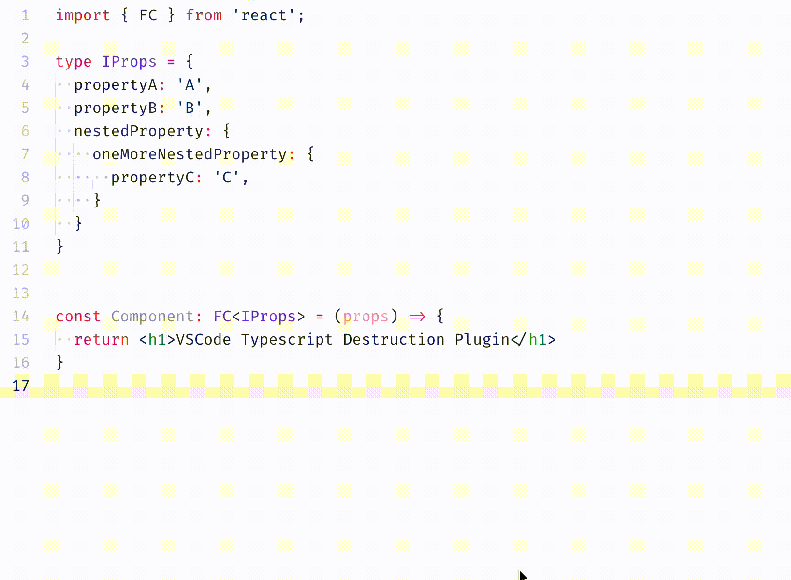
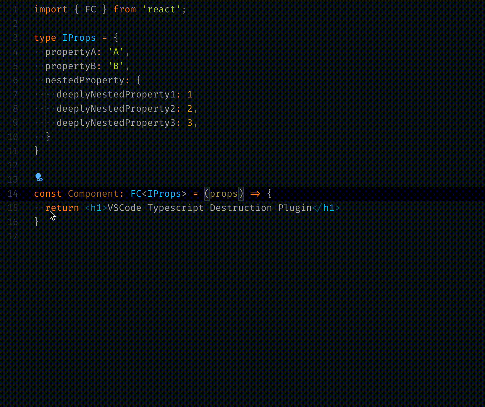
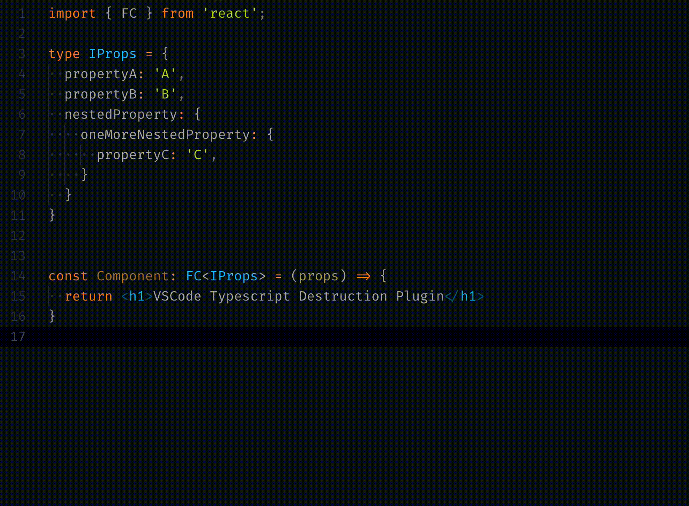
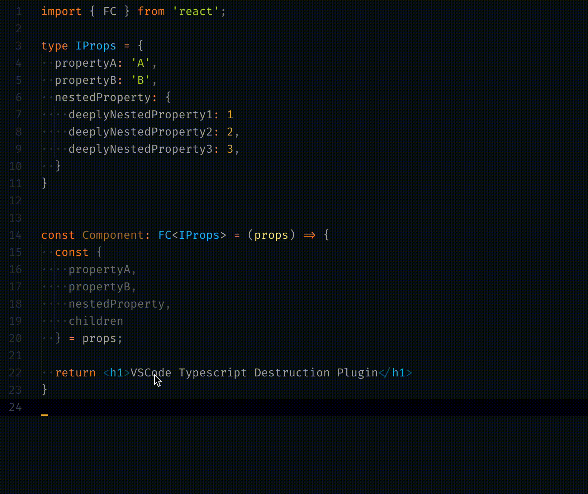
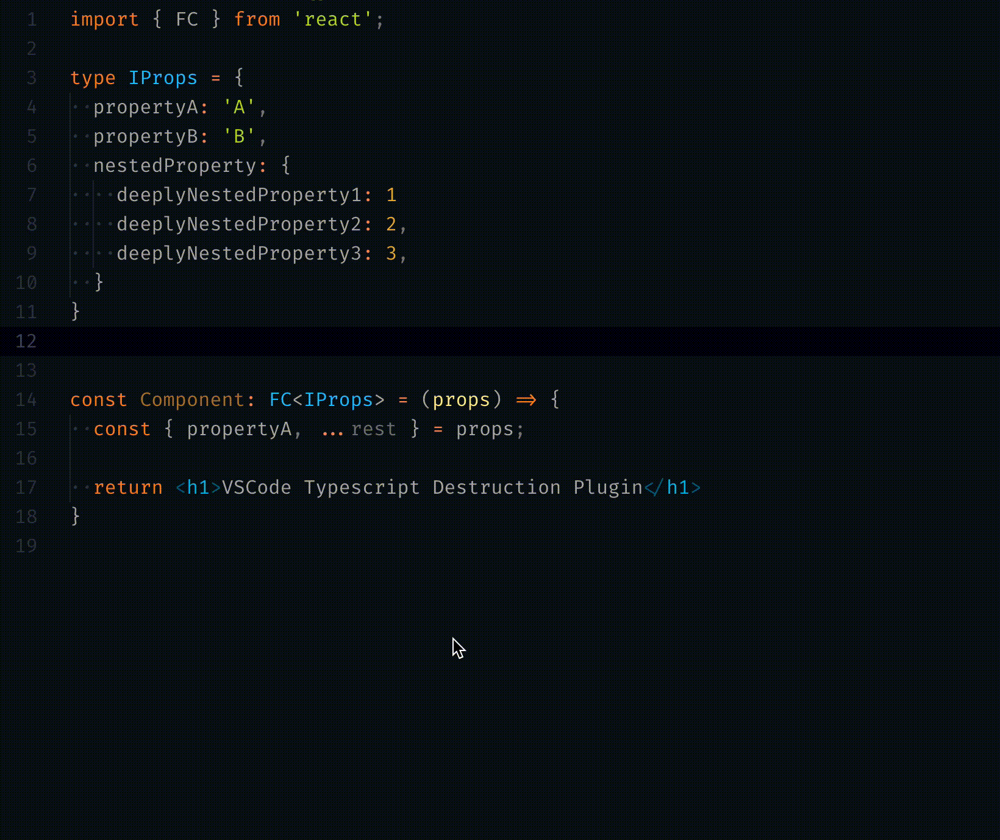

# Typescript Destructure Plugin

This [TypeScript Language Service Plugin](https://github.com/Microsoft/TypeScript/wiki/Writing-a-Language-Service-Plugin) provides a set of source actions that simplify object destructuring as well as folding specific properties in rest operator. Also available as an [extension for VSCode](https://marketplace.visualstudio.com/items?itemName=tusaeff.vscode-typescript-destructure-plugin).

*🚧 Warning: this package is now in alpha stage, so it may contain formatting bugs. Please file an issue if you encounter any strange behavior 💜 🚧*



## Why
There is a common style of coding in Javascript/Typescript when you get an object argument for a function input and destructure it, either in the first statement or directly in the arguments. Destructuring is especially [popular](https://github.com/facebook/react/blob/4c6470cb3b821f3664955290cd4c4c7ac0de733a/packages/react-reconciler/src/SchedulerWithReactIntegration.new.js#L19) [in](https://github.com/facebook/react/blob/09348798a912c8682e57c35842aa7a007e13fdb9/packages/react-devtools-shared/src/devtools/views/Profiler/Interactions.js#L48) [React Community](https://github.com/facebook/react/blob/4c6470cb3b821f3664955290cd4c4c7ac0de733a/packages/react-test-renderer/src/ReactTestRenderer.js#L94).

This plugin is designed to help you save time spent copying properties from the object.

## How to use
Almost all source actions (except for the [collapse into rest operator](#collapse-into-rest-operator)) provided by the plugin become available when you set the cursor on or highlight the variable which can be destructured. When this condition is met, a lightbulb will appear next to the desired line (check the `editor.lightbulb.enabled` setting) - clicking on it will open the refactorings and source actions menu, where you can pick the desired one. Another way to get this menu is to use `cmd + .` (on mac) or `ctrl + .` (on win) shortcut.

*Note about union types*: destructuring source actions are not available for union types since it' s impossible to understand what type of union you need to destructure. In this case, you should help the compiler by removing unnecessary types from the union:
```typescript
type ObjectA = { a: '1' }
type ObjectB = { b: '2' }
type SomeUnion = ObjectA | ObjectB;

const isA = (obj): obj is ObjectA => !!obj.a;

//  ↓ source action is unavailable here since
//  ↓ we can't determine one type for structuring
let x: SomeUnion;

if (isA(x)) {
// ↓ x now has a concrete type,
// ↓ so source action is accessible now
   x;
}
```

## Features

### Create destructuring assignment
Creates a variable with destructuring assignment of the object fields.

* before: `props`
* after: `const { a, b } = props`

<details>
  <summary>Demonstration</summary>

  
</details>


### Destructure function parameter
Replaces the function argument with destructurization. 

* before: `(props) => {/* ... */}`
* after: `({ a, b }) => {/* ... */}`

<details>
  <summary>Demonstration</summary>
   

  
</details>

### Destructure object property
Since all source actions in this plugin destructure an object only one level deep, it would be good to have a tool for unfolding specific properties. And that's what it is.

* before: `const { a } = { a: { b: 'c' } }`
* after: `const { a: { b } } = { a: { b: 'c' } }`

<details>
  <summary>Demonstration</summary>

  
</details>

### Collapse into rest operator
Collapses the selected properties into new variable with the rest operator. Reuses an existing rest variable if any exists, or creates a new one.

* before: `const { a, b, c } = { /* ... */ }`
* after: `const { a, ...rest } = { /* ... */ }`

<details>
  <summary>Demonstration</summary>

  
</details>

### Unfold the rest operator
Contrary to the previous one: expands rest operator into separate variables.

* before: `const { a, ...rest } = { /* ... */ }`
* after: `const { a, b, c } = { /* ... */ }`

<details>
  <summary>Demonstration</summary>

  
</details>


